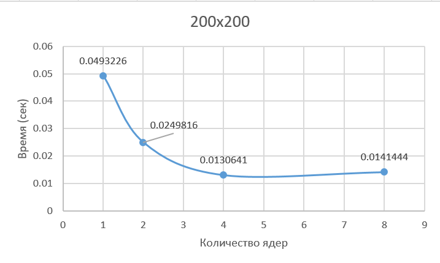

# Лабораторная работа №2
###

Описание работы: `matrix.hpp` хранит шаблонный класс матрицы с перегруженными операциями умножения и вывода. `main.cpp` генерирует матрицы заданного размера,
перемножает их, и выдаёт время работы. Пример вызова: `./lab1 200 400 800 1200 1600 2000`. verify.py позволяет проверить результат умножения с помощью numpy.

### Результаты

| Square matrix size: | Computation time: |
| --- | --- |
| 200.00 | 0.05 |
| 400.00 | 0.40 |
| 800.00 | 10.98 |
| 1200.00 | 39.75 |
| 1600.00 | 88.57 |
|2000.00 | 185.37 |

### *Характеристики моего ПК*
| Characteristic | Characteristic value |
| --- | --- |
| Processor | 12th Gen Intel(R) Core(TM) i5-12450H |
| Installed RAM | 16,0 GB |
| System type | 64-bit operating system, x64-based processor |
| Graphic card | NVIDIA GeForce RTX 3050 Laptop GPU |