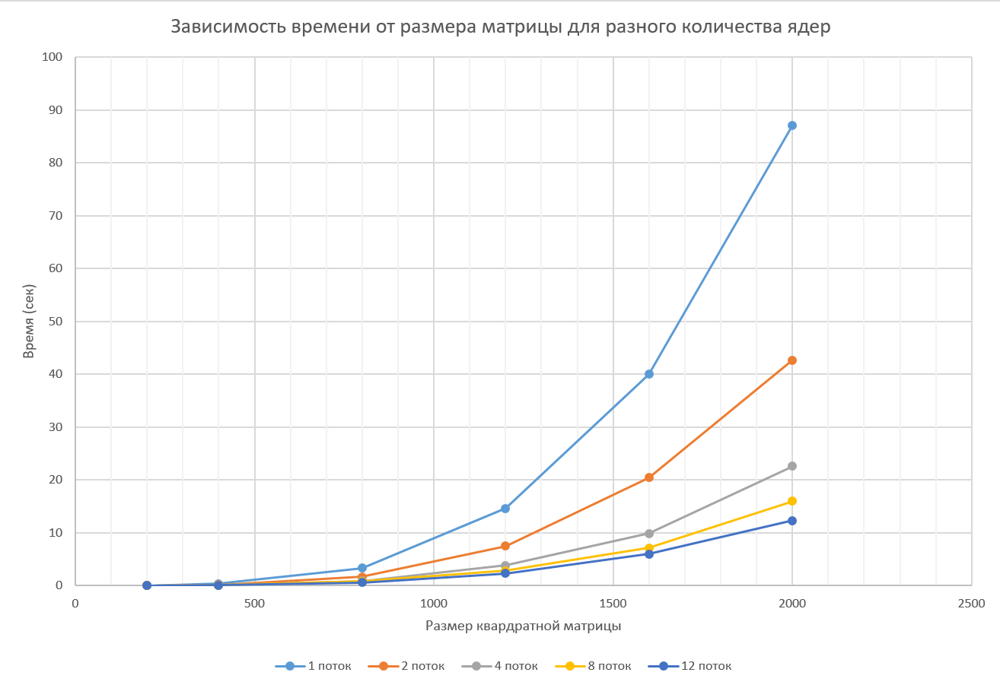

# Лабораторная работа №2
### Описание работы

Был модифицирован код первой лабораторной работы под технологию распараллеливания OpenMP. `matrix.hpp` хранит шаблонный класс матрицы
с перегруженными операциями умножения и вывода. `generator.cpp` генерирует матрицы заданного размера. `main.cpp` перемножает их, и выдаёт время работы.
`verify.py` позволяет проверить результат умножения с помощью numpy. Запустить можно, например, с помощью такого .sh скрипта:
```
#!/bin/bash

SIZES="200 400 800 1200 1600 2000"

for size in $SIZES; do
    ./lab1/out/build/x64-Debug/generator $size
    ./lab1/out/build/x64-Debug/lab2 $size
done
```
Были проведены эксперименты с разным количеством потоков (1, 2, 4, 8) и разными размерами матриц (200, 400, 800, 1200, 1600, 2000).

### Результаты
| Размер матрицы | 1 поток | 2 потока | 4 потока | 8 потоков | 12 потоков |
|:---:|:---:|:---:|:---:|:---:|:---:|
| 200x200 | 0.0467 с | 0.0254 с | 0.0175 с | 0.0177 с | 0.0158 с |
| 400x400 | 0.3928 с | 0.2012 с | 0.1086 с | 0.1123 с | 0.0872 с |
| 800x800 | 3.3401 с | 1.6849 с | 0.8716 с | 0.7950 с | 0.6351 с |
| 1200x1200 | 14.6074 с | 7.5269 с | 3.8706 с | 2.7998 с | 2.3532 с |
| 1600x1600 | 40.0231 с | 20.4470 с | 9.9008 с | 7.1210 с | 5.9963 с |
| 2000x2000 | 87.0920 с | 42.6859 с | 22.6060 с | 15.9859 с | 12.3251 с |



### Вывод

OpenMP даёт значительное ускорение по сравнению с последовательной версией.
Уже на 4 потоках время умножения матриц 2000x2000 сократилось с ~87 с до ~23 с (ускорение в 3.9 раза), а на 12 потоках — до ~12 с (ускорение в 7.2 раза).

OpenMP значительно быстрее MPI на одном узле. На 4 потоках OpenMP обгоняет 4 процесса MPI в 2–2.5 раза для больших матриц (2000x2000: 22.6 с против 43.5 с).
Причина — OpenMP использует общую память, а MPI передаёт данные через сообщения, что создаёт накладные расходы.

### Характеристики моего ПК
| Characteristic | Characteristic value |
| --- | --- |
| Processor | 12th Gen Intel(R) Core(TM) i5-12450H |
| Installed RAM | 16,0 GB |
| System type | 64-bit operating system, x64-based processor |
| Graphic card | NVIDIA GeForce RTX 3050 Laptop GPU |