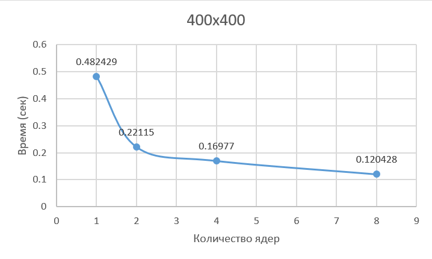
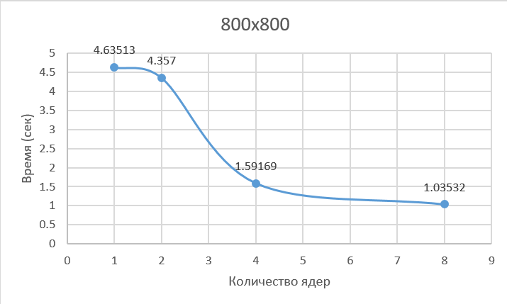
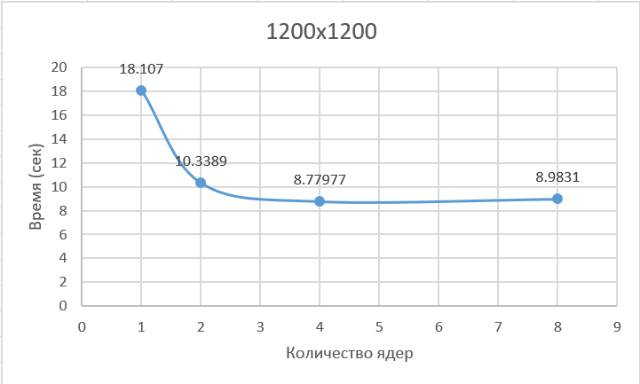
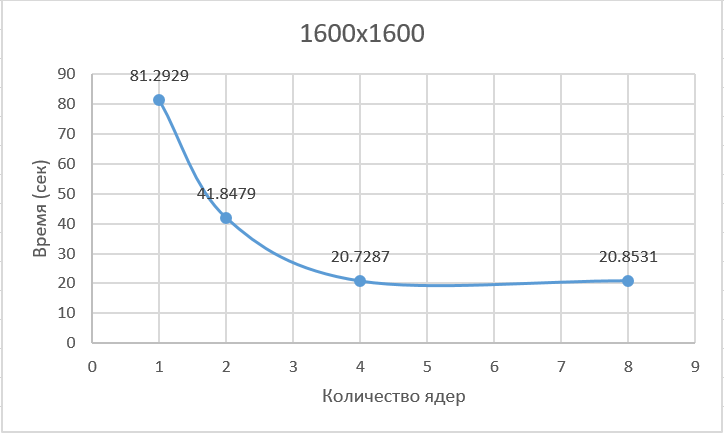
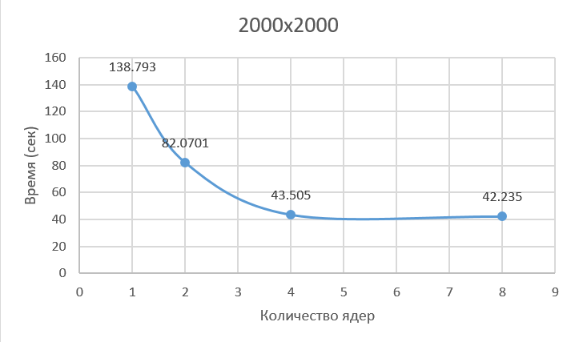

# Лабораторная работа №3
###

Описание работы: Был модифицирован код первой лабораторной работы под технологию MPI. `matrix.hpp` хранит шаблонный класс матрицы с перегруженными
операциями умножения и вывода. `generator.cpp` генерирует матрицы заданного размера. `main.cpp`перемножает их, и выдаёт время работы. 
`verify.py` позволяет проверить результат умножения с помощью numpy.
Запустить можно, например, с помощью такого .sh скрипта:
```
#!/bin/bash

SIZES="200 400 800 1200 1600 2000"
CORES="1 2 4 8"

for size in $SIZES; do
    ./lab1/out/build/x64-Debug/generator $size
    
    for np in $CORES; do
        mpiexec -n $np ./lab1/out/build/x64-Debug/lab3 $size
    done
    echo ""
done
```

### Результаты

| Размер матрицы \ Количество ядер | 1 | 2 | 4 | 8 |
| --- | --- | --- | --- | --- |
| **200x200** | 0.0493226 с | 0.0249816 с | 0.0130641 с | 0.0141444 с |
| **400x400** | 0.482429 с | 0.22115 с | 0.16977 с | 0.120428 с |
| **800x800** | 4.63513 с | 4.357 с | 1.59169 с | 1.03532 с |
| **1200x1200** | 18.107 с | 10.3389 с | 8.77977 с | 8.9831 с |
| **1600x1600** | 81.2929 с | 41.8479 с | 20.7287 с | 20.8531 с |
| **2000x2000** | 138.793 с | 82.0701 с | 43.505 с | 42.235 с |








### *Характеристики моего ПК*
| Characteristic | Characteristic value |
| --- | --- |
| Processor | 12th Gen Intel(R) Core(TM) i5-12450H |
| Installed RAM | 16,0 GB |
| System type | 64-bit operating system, x64-based processor |
| Graphic card | NVIDIA GeForce RTX 3050 Laptop GPU |