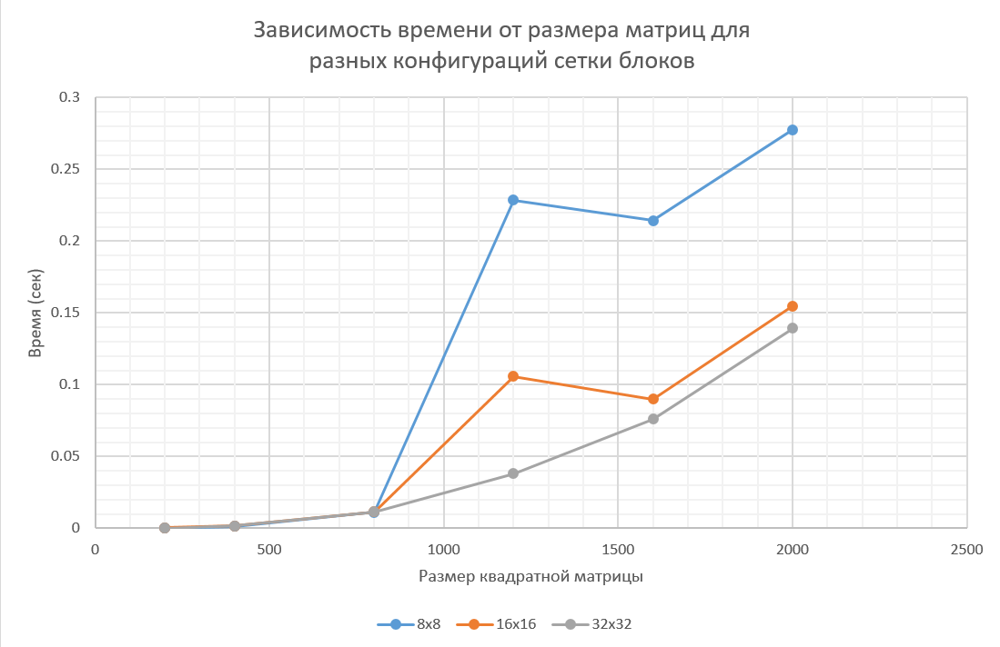
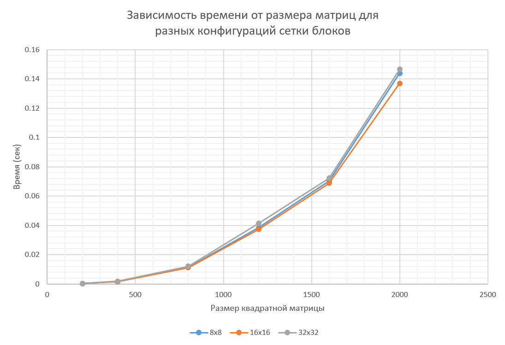
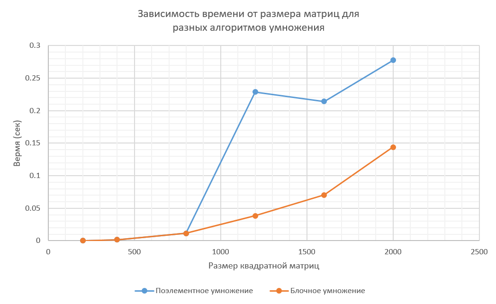
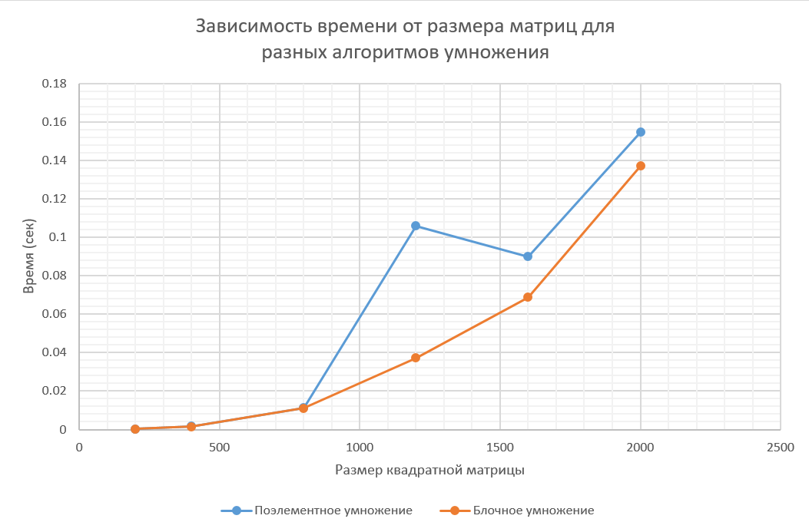
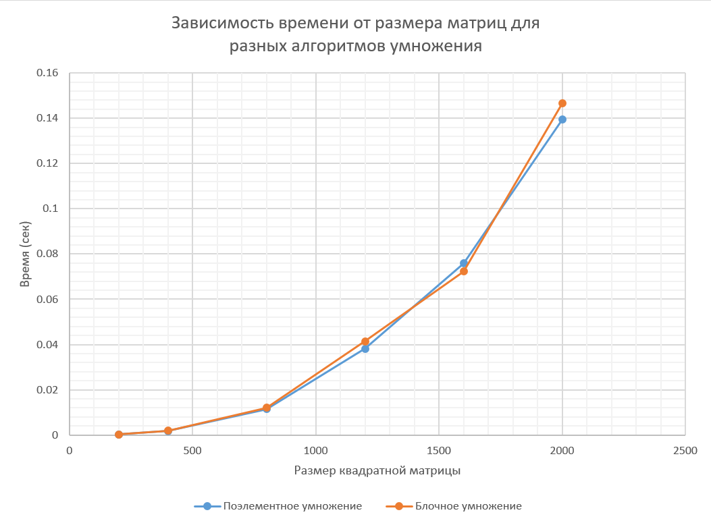

# Лабораторная работа №4
### Описание работы

Был модифицирован код первой лабораторной работы под технологию распараллеливания CUDA. 
`matrix.hpp` хранит шаблонный класс матрицы с перегруженными операциями умножения и вывода. 
`generator.cpp` генерирует матрицы заданного размера. 
`main.cpp` перемножает их, и выдаёт время работы.
`matrix_cuda.cu` содержит код, который выполняется на GPU.
`verify.py` позволяет проверить результат умножения с помощью numpy. 
Запустить можно, например, с помощью такого .sh скрипта:
```
#!/bin/bash

SIZES="200 400 800 1200 1600 2000 4000 8000"

for size in $SIZES; do
    ./lab1/out/build/x64-Debug/generator $size
    ./lab1/out/build/x64-Debug/lab4 $size
done
```
Были проведены эксперименты с разными конфигурациями сетки блоков (8x8, 16x16, 32x32) и разными размерами матриц (200, 400, 800, 1200, 1600, 2000, 4000, 8000).

### Результаты
CUDA: Поэлементное умножение
| Размер матрицы | 8×8 | 16×16 | 32×32 |
|:---:|:---:|:---:|:---:|
| 200×200 | 0.00023 с | 0.00031 с | 0.00023 с |
| 400×400 | 0.00152 с | 0.00164 с | 0.00176 с |
| 800×800 | 0.01130 с | 0.01136 с | 0.01143 с |
| 1200×1200 | 0.22870 с | 0.10595 с | 0.03819 с |
| 1600×1600 | 0.21433 с | 0.08993 с | 0.07592 с |
| 2000×2000 | 0.27759 с | 0.15472 с | 0.13934 с |
| 4000×4000 | 1.26693 с | 1.17305 с | 1.10655 с |
| 8000×8000 | 10.7852 с | 11.8802 с | 11.1029 с |

CUDA: Блочное умножение
| Размер матрицы | 8×8 | 16×16 | 32×32 |
|:---:|:---:|:---:|:---:|
| 200×200 | 0.00025 с | 0.00022 с | 0.00034 с |
| 400×400 | 0.00159 с | 0.00154 с | 0.00189 с |
| 800×800 | 0.01146 с | 0.01115 с | 0.01210 с |
| 1200×1200 | 0.03841 с | 0.03720 с | 0.04141 с |
| 1600×1600 | 0.07023 с | 0.06881 с | 0.07225 с |
| 2000×2000 | 0.14394 с | 0.13700 с | 0.14659 с |
| 4000×4000 | 1.19343 с | 1.14565 с | 1.19042 с |
| 8000×8000 | 12.4449 с | 11.1477 с | 10.9901 с |




Сравнение алгоритмов CUDA: блок 8×8
| Размер матрицы | Поэлементное умножение | Блочное умножение |
|:---:|:---:|:---:|
| 200×200 | 0.00023 с | 0.00025 с |
| 400×400 | 0.00152 с | 0.00159 с |
| 800×800 | 0.01130 с | 0.01146 с |
| 1200×1200 | 0.22870 с | 0.03841 с |
| 1600×1600 | 0.21433 с | 0.07023 с |
| 2000×2000 | 0.27759 с | 0.14394 с |
| 4000×4000 | 1.26693 с | 1.19343 с |
| 8000×8000 | 10.7852 с | 12.4449 с |

Сравнение алгоритмов CUDA: блок 16×16
| Размер матрицы | Поэлементное умножение | Блочное умножение |
|:---:|:---:|:---:|
| 200×200 | 0.00031 с | 0.00022 с |
| 400×400 | 0.00164 с | 0.00154 с |
| 800×800 | 0.01136 с | 0.01115 с |
| 1200×1200 | 0.10595 с | 0.03720 с |
| 1600×1600 | 0.08993 с | 0.06881 с |
| 2000×2000 | 0.15472 с | 0.13700 с |
| 4000×4000 | 1.17305 с | 1.14565 с |
| 8000×8000 | 11.8802 с | 11.1477 с |

Сравнение алгоритмов CUDA: блок 32×32
| Размер матрицы | Поэлементное умножение | Блочное умножение |
|:---:|:---:|:---:|
| 200×200 | 0.00023 с | 0.00034 с |
| 400×400 | 0.00176 с | 0.00189 с |
| 800×800 | 0.01143 с | 0.01210 с |
| 1200×1200 | 0.03819 с | 0.04141 с |
| 1600×1600 | 0.07592 с | 0.07225 с |
| 2000×2000 | 0.13934 с | 0.14659 с |
| 4000×4000 | 1.10655 с | 1.19042 с |
| 8000×8000 | 11.1029 с | 10.9901 с |





### Вывод

1. CUDA обеспечивает подавляющее превосходство над CPU-технологиями.
Для матрицы 2000×2000 GPU (RTX 3050) выполнил умножение за ~0.14 с, в то время как лучший CPU-результат (OpenMP, 8 потоков) — 15.99 с.
Ускорение относительно OpenMP составляет **114 раз**, относительно последовательной версии — **более 1300 раз**.

2. Разница между Naive и Tiled минимальна на RTX 3050. Tiled-алгоритм показывает себя лучше
на больших матрицах (8000×8000: 10.99 с против 11.10 с у Naive), но выигрыш составляет всего ~1%. Причины:
   - Ограниченный объём shared memory (48 КБ на блок) видеокарты
   - Эффективный L1/L2-кеш архитектуры Ampere, который частично нивелирует преимущество ручного управления памятью
   - Накладные расходы на `__syncthreads()` при малых размерах тайлов

3. Оптимальный размер блока для данной конфигурации — 32×32 для Naive и 16×16 для Tiled.
Для малых матриц (200–800) время измеряется микросекундами, и накладные расходы на запуск ядра доминируют над вычислениями.

4. Скачок времени на 1200×1200 (0.23 с для 8×8 Naive против 0.038 с для 32×32) объясняется
неоптимальной загрузкой потоков: при 8×8 блоке на матрицу 1200 приходится 150×150 = 22 500 блоков, что превышает возможности одновременного выполнения на GPU и вызывает сериализацию.

### Характеристики моего ПК
| Characteristic | Characteristic value |
| --- | --- |
| Processor | 12th Gen Intel(R) Core(TM) i5-12450H |
| Installed RAM | 16,0 GB |
| System type | 64-bit operating system, x64-based processor |
| Graphic card | NVIDIA GeForce RTX 3050 Laptop GPU |