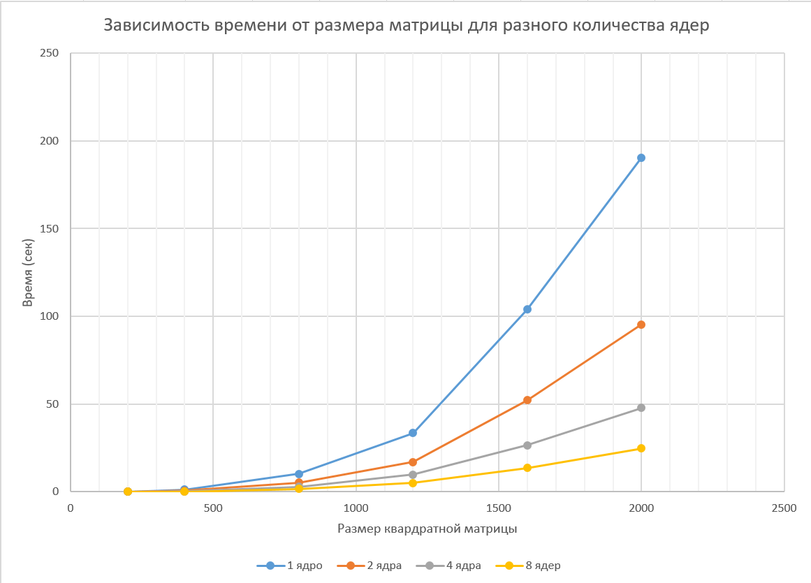
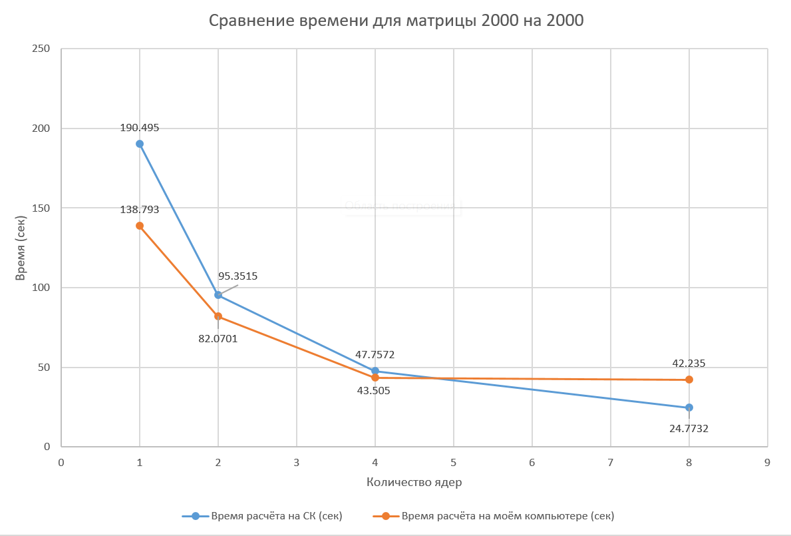

# Лабораторная работа №5
### Описание работы

Код 3-ей лабораторной работы был запущен на кластере "Сергей Королев". `matrix.hpp` хранит шаблонный класс матрицы с перегруженными
операциями умножения и вывода. `generator.cpp` генерирует матрицы заданного размера. `main.cpp`перемножает их, и выдаёт время работы. 
`verify.py` позволяет проверить результат умножения с помощью numpy. Запуск на суперкомпьютере осуществлялся с помощью скрипта в `startMPI.pbs`.
Вывод программы находится в `slurm-284088.out`.

### Результаты

| Размер матрицы \ Количество ядер | 1 | 2 | 4 | 8 |
| --- | --- | --- | --- | --- |
| **200x200** | 0.164693 с | 0.0834332 с | 0.0425611 с | 0.0215411 с |
| **400x400** | 1.34663 с | 0.674996 с | 0.341713 с | 0.172124 с |
| **800x800** | 10.272 с | 5.23115 с | 2.84274 с | 1.67489 с |
| **1200x1200** | 33.5961 с | 16.893 с | 9.83349 с | 5.11882 с |
| **1600x1600** | 103.874 с | 52.2502 с | 26.5792 с | 13.6004 с |
| **2000x2000** | 190.495 с | 95.3515 с | 47.7572 с | 24.7732 с |

### Выводы

Суперкомпьютер превосходит по скорости расчёта мой ПК только для размеров матриц от 1200
и при 8 задействованых ядрах. Во всех остальных случаях мой ПК показывает лучшее время.

### Характеристики моего ПК

| Characteristic | Characteristic value |
| --- | --- |
| Processor | 12th Gen Intel(R) Core(TM) i5-12450H |
| Installed RAM | 16,0 GB |
| System type | 64-bit operating system, x64-based processor |
| Graphic card | NVIDIA GeForce RTX 3050 Laptop GPU |